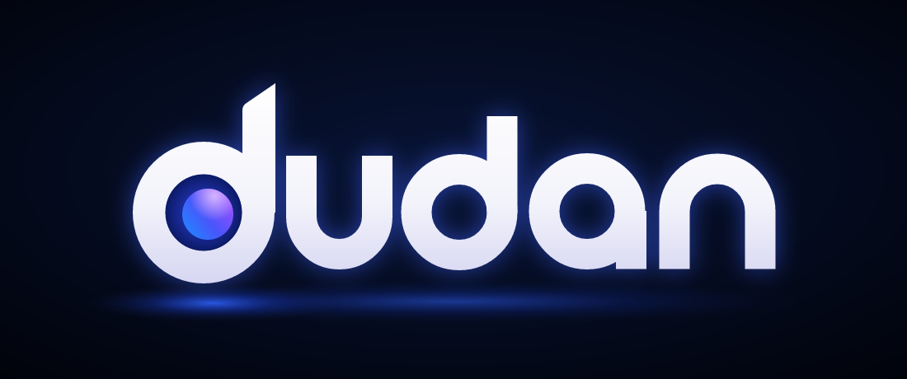
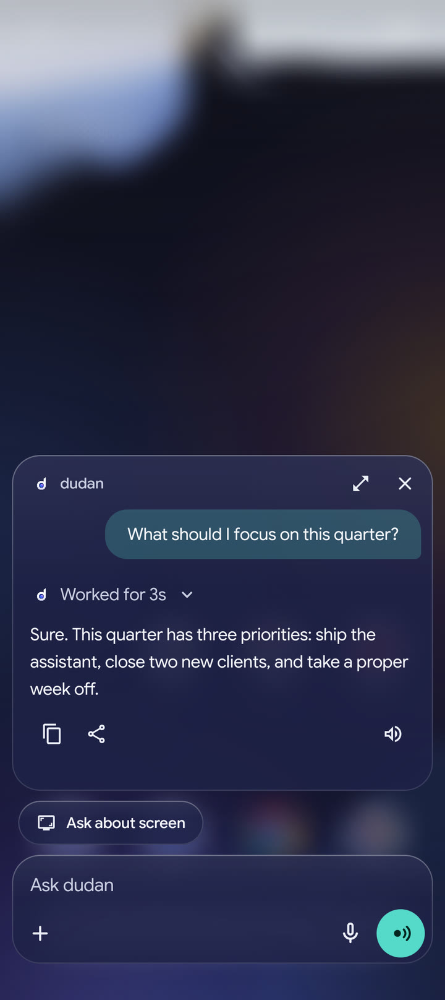
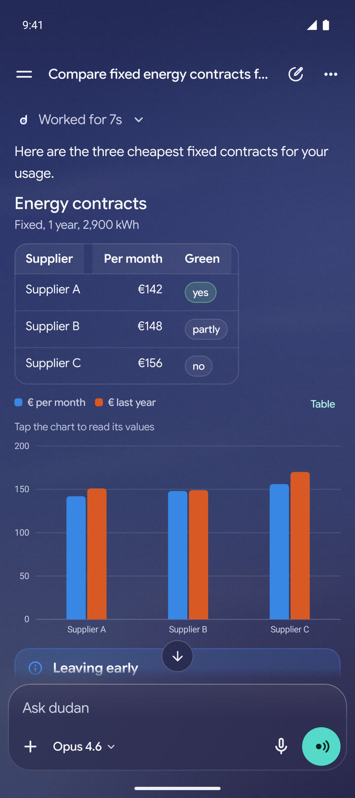
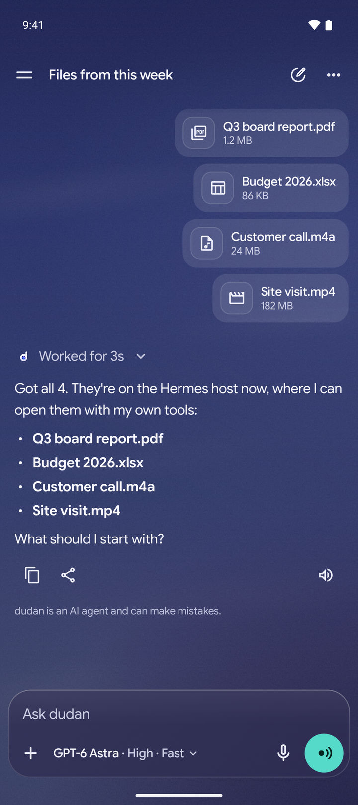
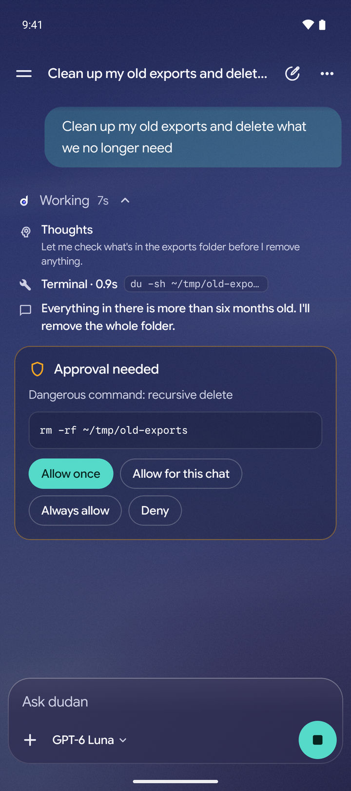
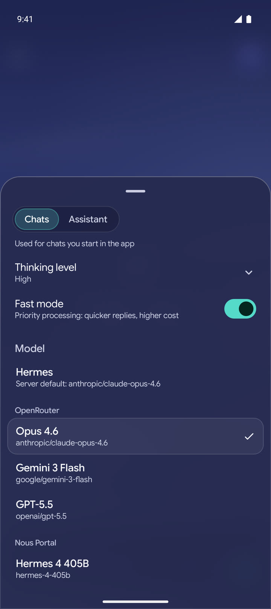
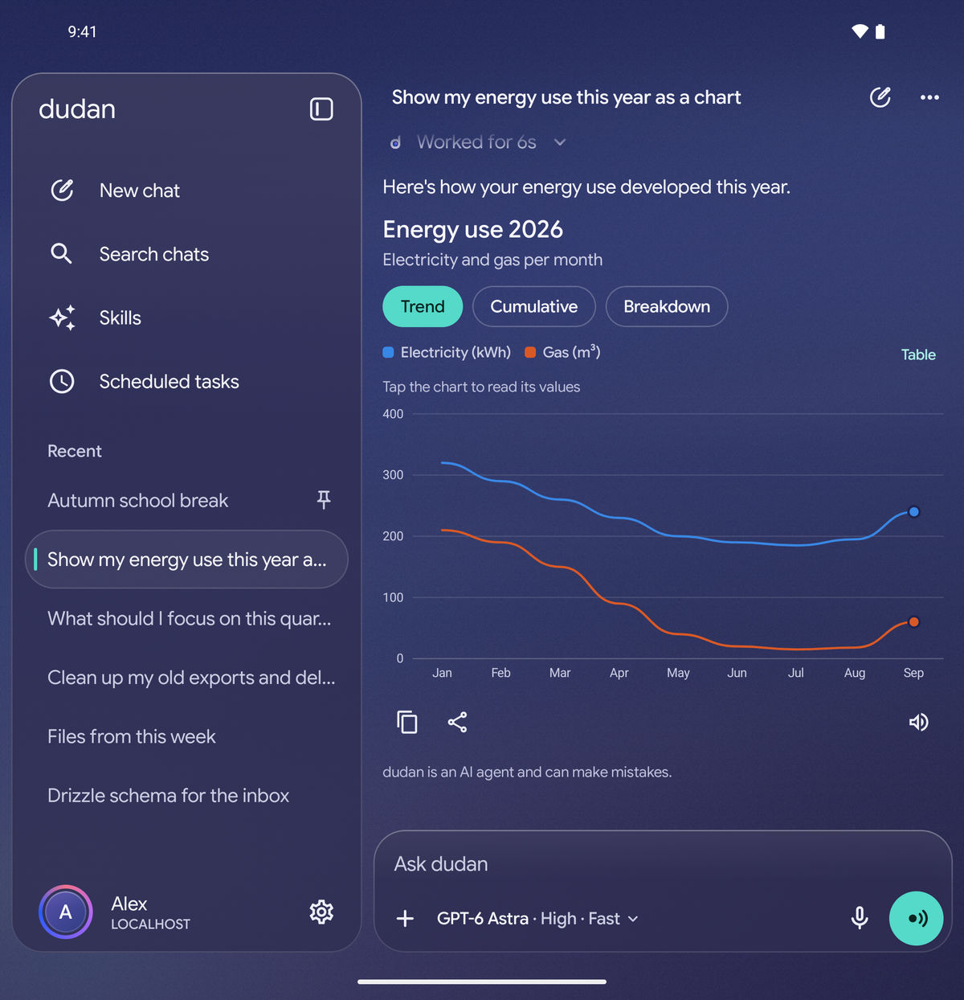

[Let your agent install and set up dudan](skills/README.md#let-your-agent-set-it-up).

  

Your Hermes agent, one side-button press away.

dudan brings your own [Hermes agent](https://github.com/NousResearch/hermes-agent) to Android. Chat, talk hands-free, ask about what's on your screen, or send a file for the agent to work on. Your conversations live in Hermes, so you can pick them up in its dashboard or CLI too.

  
  
  

## Press, speak, done

Make dudan your phone's digital assistant and hold the side button to start talking. The overlay opens over the app you're using, listens to your question and reads the answer aloud. Tap **Ask about screen** to include a screenshot, or take the conversation into the full app.

Voice input handles English, Dutch and more, with speech recognition running on your phone. Choose from 20 built-in English and Dutch voices for replies, use your Bluetooth headset's microphone, or turn on **Live mode** for a hands-free conversation.

## Give your agent a hand on your phone

"Open Spotify on my phone." "Set a timer for ten minutes." "Turn the volume down."

Hermes can open apps and links, set timers and alarms, control playback and volume, and check your phone's status. You can ask from dudan or another Hermes channel, including Telegram.

## Replies you can use

A comparison can be a table. A trend can be a chart. A question can come with a form or a few choices to tap.

dudan renders rich replies inside the chat: charts, tables, steps, tabs, forms and buttons. Tap a chart to inspect its values, submit a form, or tap a suggestion to keep going. Copying and sharing preserve the tables and lists. Markdown and code blocks work too.

## Send the whole file

Attach photos, PDFs, spreadsheets, audio, video or other files, with up to eight attachments per message and files up to 250 MB. Share them straight from another Android app. Photos go to the model as images; other files go to the Hermes host, where the agent can read, transcribe or inspect them with its tools.

Uploads resume after a dropped connection. Files other than photos need the small [upload service](tools/hermes-upload/README.md) alongside Hermes.

## Keep up with the work

Watch the agent's steps as it works, expand the details when you need them, and answer approval requests before Hermes runs commands that require your permission. Text and file tasks keep running on the server if your connection drops; dudan catches up when you're back. You'll get a notification when a reply arrives while you're elsewhere.

Search, pin and rename chats. Browse Hermes skills, or type `$` in a message to tell the agent which skill to use. Run, pause or resume scheduled tasks. Conversations from other Hermes channels can appear in your chat list too.

## Pick the model and the mood

Choose from the models your Hermes server offers, adjust the thinking level, and use fast mode where supported. Set separate defaults for app chats and the assistant overlay, so a quick spoken question can use a different model from a longer task.

Six backgrounds, eight accent colors, frosted glass and a layout that adapts to a foldable's inner and cover screens. Reduce transparency switches the glass to solid panels. The interface is available in English and Dutch.

  
  
  

## Get started

You'll need Android 12 or later on a 64-bit ARM phone, your own Hermes API server, and Tailscale connecting the phone and server. Download the APK from the [latest release](https://github.com/MajesteitBart/dudan/releases/latest), or build it yourself.

For guided installation, [copy the setup prompt and let your agent prepare Hermes and walk you through the phone setup](skills/README.md#let-your-agent-set-it-up).

- [Connect Hermes and set up your phone](docs/setup.md)
- [Build the APK and develop locally](docs/development.md)
- [Upgrade an existing installation](docs/upgrading.md)
- [Behavior, limitations and model credits](docs/reference.md)

[Documentation](docs/README.md) | [Brand assets and animated reveal](docs/branding.md)

## License

dudan is released under the [MIT License](LICENSE). The bundled Google Sans Flex and Google Sans Code fonts are under the SIL Open Font License 1.1; their license files are in [licenses/](licenses/). The speech models the app downloads on first use have their own licenses, listed under [Model credits](docs/reference.md#model-credits).
